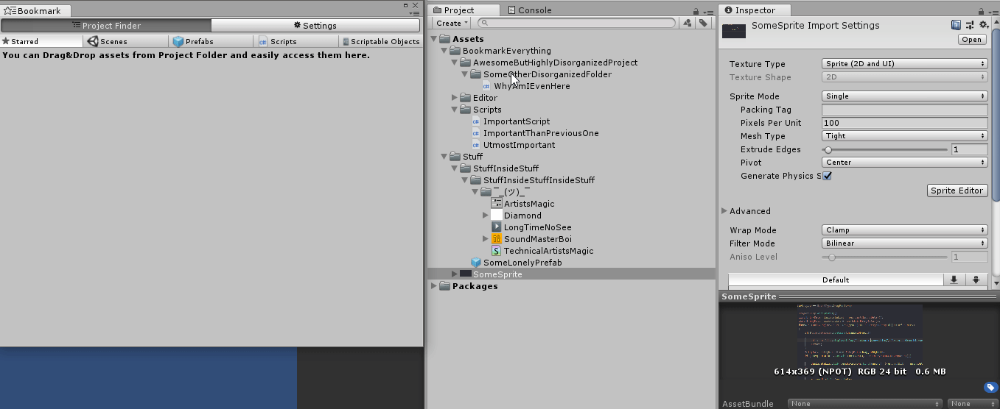
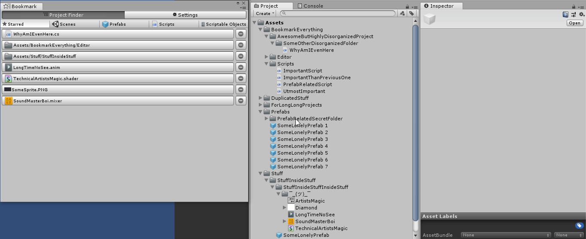

# bookmark-everything
## About
This tool enables you to add bookmarks to your project files so you can reach them easily. You can bookmark anything that exists and lives on your project folder. The shortcut is *CTRL+H* or you can open it in Window/Bookmark Everything. It also reflects to path/name changes, asset removals correctly.

## Download
[Asset Store Page](https://assetstore.unity.com/packages/tools/utilities/bookmark-everything-134467), or clone/download this repository and add the folder named *BookmarkEverything* to your *Assets* folder.

## How to Use
Here are some quick gifs and explanation on how to use it:

### Bookmarking Assets
Drag&Drop assets from project folder to the Bookmark window.

### Bookmarking Multiple Assets 
You can select multiple assets from project folder to bookmark them at once. Please note that categories are just for organization purpose, so you can add any asset to any category as you see fit.

### Navigating to Assets
Just click to the bookmarks and you will be navigated to the asset itself. Your Project window will be automatically focused if it's not active.

### Settings
In Settings tab, you can manage your registered assets quickly(changing their category, checking them or removing them). Other than that, there are General Settings which is kind of important. Here are the explanations:

• **Current Ping Type :** Can be Selection, Ping and Both. Selection will only select the object, Ping will  only ping the object(ping is some kind of highlight effect of unity) and Both is, well, doing both.

• **Auto Close :** When you click a bookmark to navigate to the asset, the editor will be automatically closed.

• **Show Full Path :** Shows full path of the assets(except folder). For example, instead of showing *MyScript.cs* it will show *Assets/Scripts/MyScript.cs*

• **Show Full Path(Folders) :** Shows full path of the folders. This is enabled by default, because you may have such organization in your project which would use a lot of same-named folders, this is handy.

• **Visual Mode(Experimental) :** Use it at your own risk. My brain made this in auto-mode while I wasn't actively managing it.

## Background Explanation and Limitations
• The system uses json to serialize saved data throught *IOHelper.cs* class. Data is being saved to `Application.persistentDataPath` as `bookmarkeverythingsettings`. It's at *%userprofile%\appdata\locallow\[CompanyName]\[GameName]\bookmarkeverythingsettings.dat* in Windows, I have no idea where it is in Mac.

• The data being used is *GUID* of assets. So whether you change the name or path of the asset, even delete it, Bookmark Everything will reflect accordingly. In a previous version, I was tracking path of the assets. This was suggested by a reddit user named All4thlulz in [this topic.](https://www.reddit.com/r/Unity3D/comments/a1x43r/i_made_an_editor_for_ease_of_access_to_project/) I thank him again for his suggestion.

• The icons are the ones which are built inside Unity editor, so no external icons are actually used.

### Limitations
• Currently, although fairly enough in my opinion(Starred, Scenes, Prefabs, Scripts, Scriptable Objects) the categories are hardcoded. Which means you can't add your own categories, or remove them of course. I'm planning to add customizable categories so you can add your own categories.

• Bookmarking objects in hierarchy is not supported. Please contact me if you would like to have this feature, or you can contribute of course.

• Reorganizing row of bookmarks is not possible. I can add up and down buttons right next to bookmarks, but I didn't see the necessity. On the side note, I tried to do it with Drag&Drop but I couldn't really achieve it. So if you have this piece of information, please contact me.
